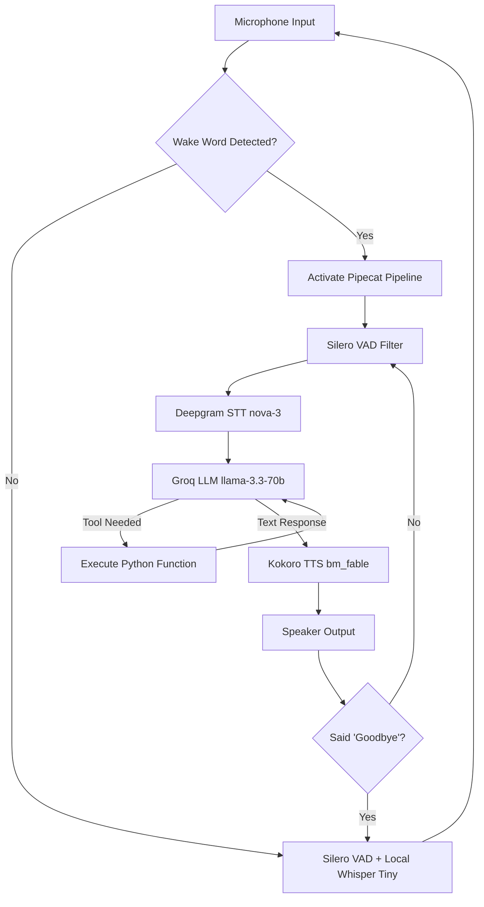

<div align="center">
  
  
  # Jarvis AI — Intelligent Desktop Assistant
  
  **An ultra-fast, highly capable, and fully autonomous voice assistant built with Pipecat, Deepgram, Groq, and Kokoro TTS.**
  
  [](https://www.python.org/)
  [](LICENSE)
  [](https://groq.com/)
  [](https://deepgram.com/)
  [](https://github.com/hexgrad/kokoro)

  *Inspired by Tony Stark's J.A.R.V.I.S.*
</div>

---

## 💡 Recommended Repository Names
If you are looking to rebrand or rename this repository to something more concise and professional, here are a few suggestions:
1. `jarvis-desktop-agent`
2. `jarvis-pipecat-assistant`
3. `voice-ai-jarvis`
4. `jarvis-agentic-desktop`
5. `project-jarvis-ai`

---

## 📖 Table of Contents
1. [Overview](#-overview)
2. [Key Features](#-key-features)
3. [Architecture & Tech Stack](#-architecture--tech-stack)
4. [Agent Capabilities & Tools](#-agent-capabilities--tools)
5. [Prerequisites](#-prerequisites)
6. [Installation](#-installation)
7. [Configuration](#-configuration)
8. [Usage](#-usage)
9. [How It Works (Under the Hood)](#-how-it-works-under-the-hood)
10. [Extending Jarvis (Add Your Own Tools)](#-extending-jarvis-add-your-own-tools)
11. [Troubleshooting](#-troubleshooting)
12. [Roadmap](#-roadmap)
13. [Contributing](#-contributing)
14. [License](#-license)

---

## 🚀 Overview

**Jarvis** is a state-of-the-art voice-activated AI desktop assistant designed to provide a truly conversational and agentic experience. Instead of just answering questions, Jarvis can **take actions** on your computer. 

Built on top of the **Pipecat** framework, Jarvis achieves ultra-low latency conversational AI by streaming audio continuously and processing it through a pipeline of modern AI services. It sleeps in the background consuming zero API credits, wakes up instantly when you say the wake word, and executes commands flawlessly.

---

## ✨ Key Features

- **Zero-Cost Offline Wake Word Detection:** Uses `faster-whisper` (Tiny model) and `Silero VAD` on your local CPU to listen for the wake word ("Jarvis") without sending any data to the cloud or consuming API credits.
- **Ultra-Low Latency Conversational Pipeline:** Powered by the Pipecat framework, ensuring lightning-fast responses.
- **Agentic Capabilities:** Jarvis can control your system volume, adjust screen brightness, create files and folders, open applications, search the web, and execute arbitrary PowerShell commands.
- **State-of-the-Art AI Stack:** 
  - **STT (Speech-to-Text):** Deepgram (`nova-3-general`) for incredibly fast and accurate transcription.
  - **LLM (Brain):** Groq API (`llama-3.3-70b-versatile`) for instantaneous reasoning and tool-calling.
  - **TTS (Text-to-Speech):** Kokoro ONNX (`bm_fable`) for a high-quality, natural-sounding British male voice running locally.
- **Context-Aware Memory:** Maintains a rolling window of conversational context so you can have continuous, natural dialogue.
- **Automatic Echo Suppression:** Intelligently mutes its own listening pipeline when speaking to prevent echoing and self-triggering.
- **Auto-Sleep:** Automatically detects when you say "Goodbye" or "Go to sleep" and gracefully shuts down the active cloud pipeline to save resources.

---

## 🏗️ Architecture & Tech Stack

Jarvis operates in two distinct phases: **Offline Wake Phase** and **Active Session Phase**.



### Core Technologies
- **[Pipecat](https://github.com/pipecat-ai/pipecat):** The backbone pipeline orchestrator that handles asynchronous streaming of audio frames between components.
- **[Silero VAD](https://github.com/snakers4/silero-vad):** Voice Activity Detection used to filter out background noise and only process human speech.
- **[Faster-Whisper](https://github.com/SYSTRAN/faster-whisper):** Local STT used exclusively for detecting the wake word efficiently on CPU.
- **[Deepgram](https://deepgram.com/):** Enterprise-grade, ultra-fast streaming Speech-to-Text.
- **[Groq](https://groq.com/):** LPU Inference Engine providing massive tokens-per-second throughput for the LLM.
- **[Kokoro TTS](https://github.com/hexgrad/kokoro):** A highly natural local Text-to-Speech engine.

---

## 🛠️ Agent Capabilities & Tools

Jarvis is not just a chatbot; it is an autonomous agent. Through the `modules/actions.py` file, Jarvis is equipped with "tools" it can call to interact with your system.

| Tool Name | Description | Example Voice Command |
| :--- | :--- | :--- |
| `open_url` | Opens any specified URL in your default browser. | *"Jarvis, search YouTube for cyberpunk synthwave."* |
| `open_application` | Launches applications installed on your system. | *"Open Google Chrome."* |
| `set_volume` | Sets the system volume to a specific percentage. | *"Set the volume to 50 percent."* |
| `volume_up` / `down`| Increases or decreases the volume by 10%. | *"Make it a little louder."* |
| `set_brightness` | Adjusts the monitor brightness. | *"Lower the screen brightness to 30."* |
| `create_folder` | Creates a new directory on the file system. | *"Create a folder named Project Alpha on my desktop."* |
| `create_file` | Creates a new empty file. | *"Create a file called notes.txt."* |
| `get_weather` | Fetches real-time weather using OpenWeatherMap. | *"What's the weather like in New York today?"* |
| `run_system_command`| Executes raw PowerShell commands. | *"Ping google.com and tell me the latency."* |
| `get_time` | Reads out the current system time. | *"What time is it?"* |
| `tell_joke` | Tells a random programmer joke. | *"Tell me a joke, Jarvis."* |
| `configure_startup` | Configures Jarvis to start silently on boot. | *"Set yourself to launch on startup."* |

---

## 📋 Prerequisites

Before you begin, ensure you have the following:

1. **Operating System:** Windows 10 or 11 (some tools rely on Windows APIs like `pycaw` and `subprocess` with PowerShell).
2. **Python:** Python 3.9, 3.10, or 3.11 installed.
3. **Microphone & Speakers:** Working audio input/output devices.
4. **API Keys:**
   - **Groq API Key:** For the LLM ([Get it here](https://console.groq.com/keys))
   - **Deepgram API Key:** For STT ([Get it here](https://console.deepgram.com/))
   - **OpenRouter API Key:** (Optional, alternative LLM provider)
   - **OpenWeatherMap Key:** (Optional, for weather queries)

---

## 💻 Installation

Follow these steps to set up Jarvis on your local machine.

### 1. Clone the Repository
```bash
git clone https://github.com/vineetrawat1710/Jarvis-Voice-assistant-can-access-your-system.git
cd Jarvis-Voice-assistant-can-access-your-system
```

### 2. Create a Virtual Environment
It is highly recommended to use a virtual environment to manage dependencies.
```bash
python -m venv venv
```
Activate the virtual environment:
- **Windows:**
  ```cmd
  .\venv\Scripts\activate
  ```

### 3. Install Dependencies
Install all required packages from `requirements.txt`.
```bash
pip install -r requirements.txt
```
*(Note: Installing PyTorch for local Kokoro/Whisper may take some time depending on your internet connection.)*

---

## ⚙️ Configuration

Jarvis requires configuration for API keys and hardware preferences. 

1. You will find a file named `env.example` in the root directory.
2. Rename it to `config.ini` (or copy its contents into a new `config.ini` file).
3. Open `config.ini` and fill in your API keys.

**Example `config.ini`:**
```ini
[General]
WakeWord = hello
whisper_model = medium.en

[Audio]
# You can change device_index if Jarvis uses the wrong microphone
device_index = 1
vad_threshold = 0.5
vad_trigger_time = 0.06
vad_release_time = 1.0

[AI]
model = meta-llama/llama-3.3-70b-instruct:free
groq_model = llama-3.3-70b-versatile
app_name = Jarvis Assistant
site_url = https://github.com/your-repo/jarvis
api_endpoint = https://openrouter.ai/api/v1/chat/completions

[APIs]
OpenRouter_api_key = YOUR_OPENROUTER_API_KEY
Groq_api_key = gsk_YOUR_GROQ_KEY_HERE
Deepgram_api_key = YOUR_DEEPGRAM_KEY_HERE
OpenWeatherMap_key = YOUR_OPENWEATHERMAP_API_KEY
```

---

## 🎧 Usage

To start Jarvis, ensure your virtual environment is active and run the main script:

```bash
python jarvis.py
```

### 1. The Offline Phase (Standby)
Upon launching, Jarvis will output a dashboard of its current stack and announce:
`Listening for 'Jarvis' offline (0 API cost)...`
At this stage, Jarvis is listening locally. Nothing is sent to the internet.

### 2. Waking Jarvis Up
Say the wake word: **"Jarvis"** (or "Hey", "Hello", "Buddy").
The system will log: `⏰ Wake word matched — starting Jarvis!`
You will hear Kokoro TTS say: *"Jarvis online. Ready when you are, Vineet."*

### 3. Interacting
Now, Jarvis is streaming audio to Deepgram and Groq. Speak naturally!
- *"Jarvis, open Notepad."*
- *"Can you search Google for the latest space news?"*
- *"Set my volume to 100 percent."*

### 4. Going to Sleep
When you are done, simply say:
- *"Goodbye"*
- *"Go to sleep"*
- *"Bye"*

Jarvis will reply politely, shut down the active internet connection, and return to zero-cost offline wake word monitoring.

---

## 🧠 How It Works (Under the Hood)

### 1. VAD-Gated Whisper (Offline)
Listening continuously with Whisper uses a lot of CPU. Jarvis solves this by using **Silero VAD** as a gatekeeper. Whisper only processes audio chunks if Silero detects a human voice with > 75% confidence. If the transcription matches the wake word, it triggers the main Pipecat pipeline.

### 2. Pipecat Pipeline (Active)
Once awake, Jarvis builds a `PipelineTask`.
- **LocalAudioTransport** reads from the mic and writes to the speakers.
- **DeepgramSTTService** transcribes your voice in real-time.
- **LLMContextAggregator** packages your text and the system prompt for the LLM.
- **OpenAILLMService** (connected to Groq) generates a response or decides to call a tool.
- **KokoroTTSService** synthesizes the text response into a British male voice.

### 3. Tool Execution via Function Calling
When the LLM decides to perform an action (e.g., opening a URL), it generates a JSON payload representing the function name and arguments. `actions.py` dynamically parses function docstrings (YAML schemas) to register these tools with the LLM, making it completely modular.

---

## 🔌 Extending Jarvis (Add Your Own Tools)

Adding new capabilities to Jarvis is incredibly easy thanks to dynamic schema parsing.

To add a new tool:
1. Open `modules/actions.py`.
2. Write a standard Python function.
3. Include a `tool_schema` block in YAML format inside the docstring.
4. Add the function name to the `TOOL_FUNCTIONS` list at the bottom of the file.

**Example: Adding a "Lock Computer" tool:**

```python
import ctypes

def lock_computer():
    """
    Locks the user's Windows computer instantly.

    tool_schema:
      properties: {}
    """
    ctypes.windll.user32.LockWorkStation()
    return "I have locked the computer for you."
    
# Then, scroll down in actions.py and add it to the list:
TOOL_FUNCTIONS = [
    # ... existing tools ...
    lock_computer,
]
```
Restart Jarvis, and you can now say: *"Jarvis, lock my PC."*

---

## 🐛 Troubleshooting

| Issue | Cause & Solution |
| :--- | :--- |
| **Microphone not picking up audio** | Check your `device_index` in `config.ini`. Run `mic_test.py` to identify your correct microphone ID. |
| **"Missing API Key" error** | Ensure `config.ini` has valid keys for Groq and Deepgram. Do not use quotes around the keys in the ini file. |
| **Jarvis triggers randomly** | Adjust the `vad_threshold` in `config.ini` to a higher value (e.g., `0.7` or `0.8`) to make it less sensitive to background noise. |
| **"Error importing pycaw"** | Make sure you are on Windows. Pycaw does not support Mac or Linux. |
| **TTS is slow or choppy** | Kokoro requires a decent CPU. Ensure no heavy background tasks are running, or switch the TTS provider to a cloud service if needed. |

---

## 🗺️ Roadmap

- [x] Integrate Pipecat for low-latency streaming.
- [x] Implement local zero-cost wake word detection.
- [x] Dynamic tool parsing from Python docstrings.
- [ ] **Cross-Platform Support:** Replace Windows-specific libraries (`pycaw`, `screen-brightness-control`) with cross-platform alternatives for Mac/Linux.
- [ ] **Vision Capabilities:** Integrate a webcam feed to allow Jarvis to "see" the screen or the user using vision-language models.
- [ ] **Persistent Memory:** Integrate a vector database (like ChromaDB or Pinecone) to remember facts across reboots.

---

## 🤝 Contributing

Contributions are what make the open-source community such an amazing place to learn, inspire, and create. Any contributions you make are **greatly appreciated**.

1. Fork the Project
2. Create your Feature Branch (`git checkout -b feature/AmazingFeature`)
3. Commit your Changes (`git commit -m 'Add some AmazingFeature'`)
4. Push to the Branch (`git push origin feature/AmazingFeature`)
5. Open a Pull Request

---

## 📄 License

Distributed under the MIT License. See `LICENSE` for more information.

---

## 🙏 Acknowledgements

- [Pipecat AI](https://github.com/pipecat-ai/pipecat)
- [Groq](https://groq.com/)
- [Deepgram](https://deepgram.com/)
- [Faster-Whisper](https://github.com/SYSTRAN/faster-whisper)
- [Kokoro](https://github.com/hexgrad/kokoro)
- [Silero VAD](https://github.com/snakers4/silero-vad)

<div align="center">
  <i>"Sometimes you gotta run before you can walk."</i> — Tony Stark
</div>
